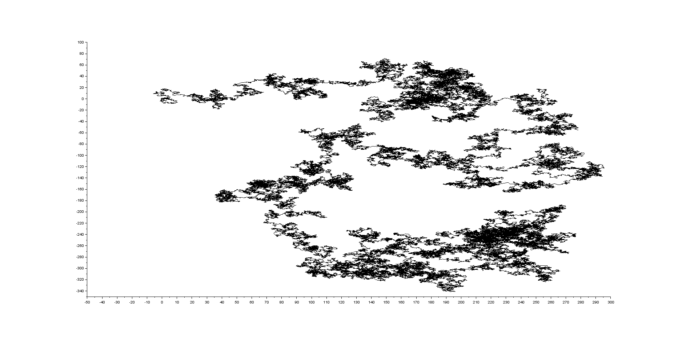
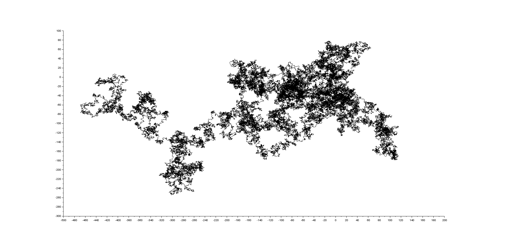
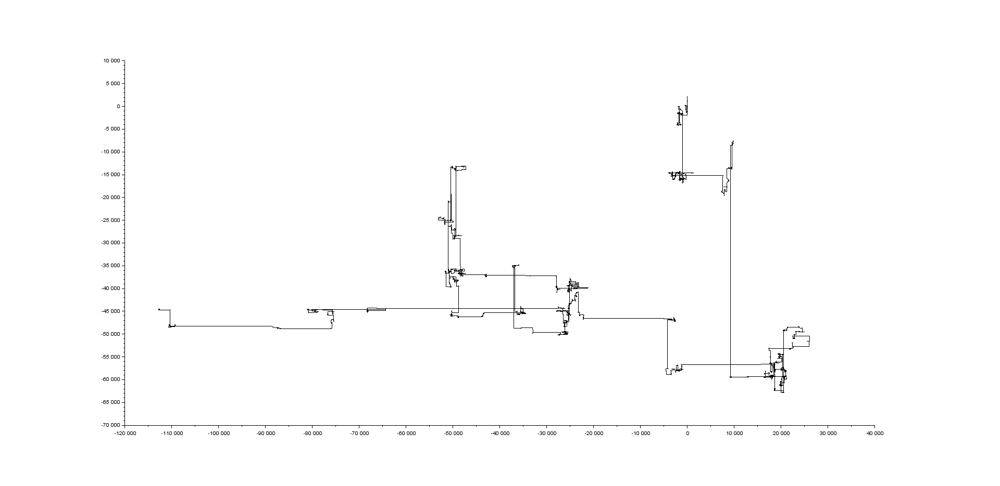
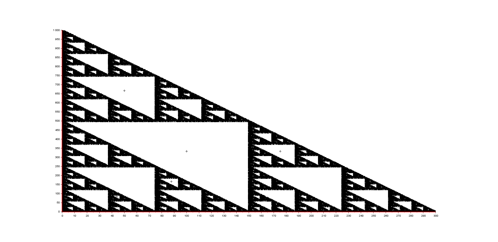

# random-walk
Scilab functions which plot multiple types of random walk. Created for CS course assigment.

## used technologies

 - Scilab 6.x.x

## usage

After loading all .sci/.sce files from this repository into Scilab use one of the following functions:

* `plotPositions(generationMethod, amount)` where `amount` is number of random steps and `generationMethod` is one of the following callback functions:
	* `generateFixedPositons` where deltas between steps are constant
    * `generateGaussianPositions` where deltas between steps are chosen from Gaussian Distribution
    * `generateCauchyPositions` where deltas between steps are chosen from Cauchy Distribution

* `plotTriangle(generationMethod, amount, A, B, C)` where `amount` is number of random steps, `A, B and C` are triangle vertexes and `generationMethod` is one of the following callback functions:
	* `generateTriangledPositions` where every next step is a midway between current position and randomly chosen triangle vertex.

* `summary(generationMethod, numOfParticles, amount)` which summarizes generation method properites like mean of point and their standard deviation. Arguments have the same meaning as in `plotPositions` with additional `numOfParticles` which specifies number of random walking particles used for summarising. Does not yet support `generateTriangledPositions` as a generationMethod.

## examples

* `plotPositions(generateFixedPositons, 100000)`: 

* `plotPositions(generateGaussianPositons, 100000)`: 

* `plotPositions(generateCauchyPositons, 100000)`: 

* `plotTriangle(generateTriangledPositions, 100000, [0, 0], [0, 100], [100, 0])`: 

